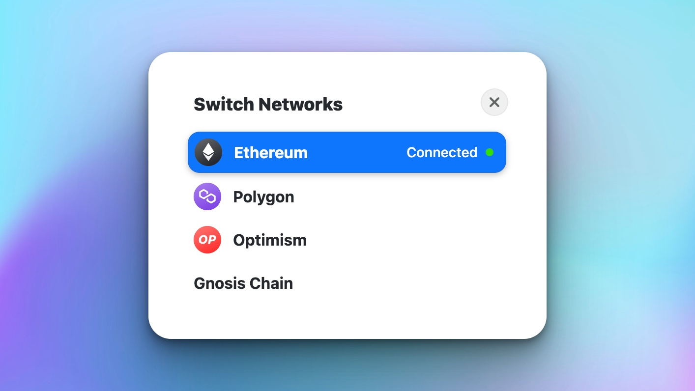

  

  <b>
    txn.xyz
  </b>
   
  A dedicated page for Ethereum transactions. Never load ethers.js or web3.js again!
</i>

 

## [txn.xyz](https://txn.xyz)

  

## Network Support

## Wallet Support

## Roadmap

- [ ] npm module (drop-in replacement for ethers.js)
- [ ] txn statuses
- [ ] More examples
- [ ] Support Arbitrum

## Built With

Optimism, Polygon, Next.js, etc.

## Integrations

To integrate with the Hardhat environment, try the [Hardhat plugin by SolidState](https://github.com/solidstate-network/hardhat-txn-dot-xyz).

## EthBogota

To view the full project description, read [the EthBogota project page](https://ethglobal.com/showcase/txn-xyz-knbjw).
